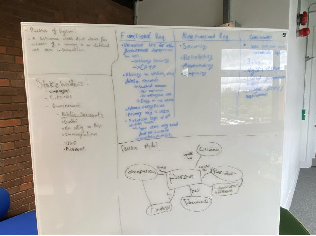
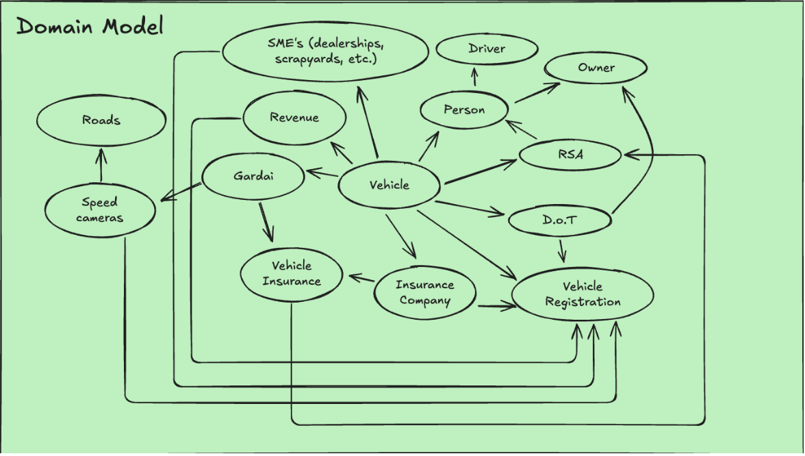
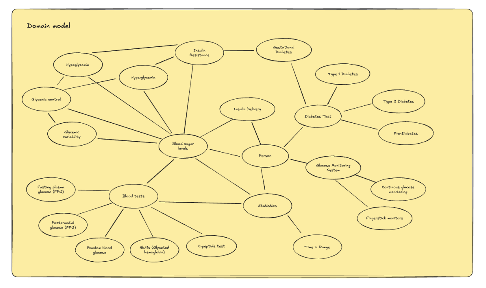
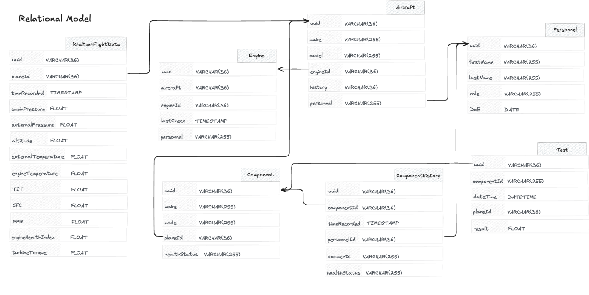
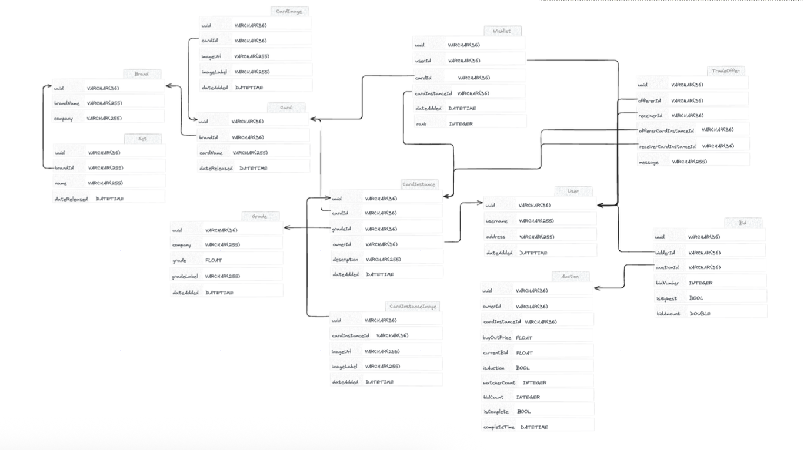
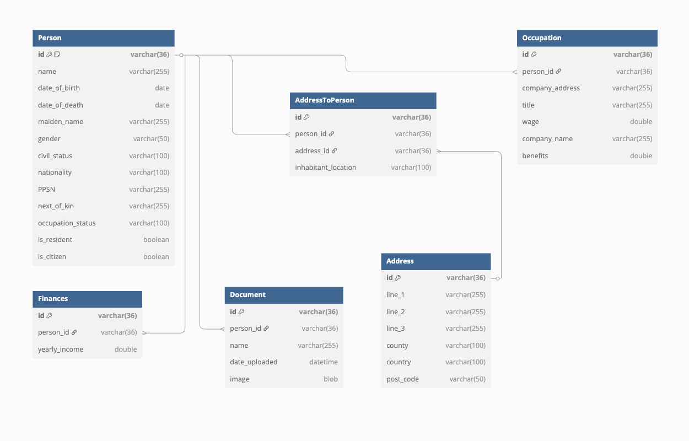
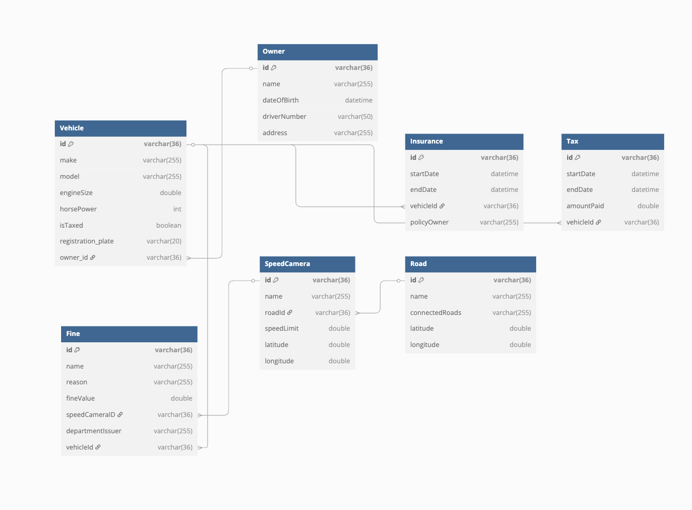
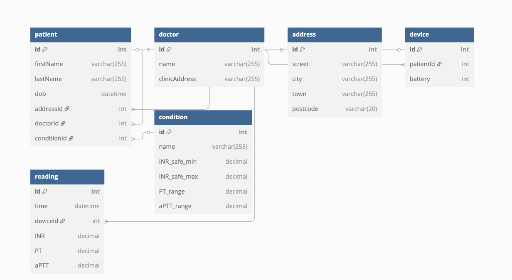

# Relational Databases

## Table of Contents

- [List of Figures](#list-of-figures)
1. [Introduction](#1-introduction)
2. [Domain Analysis](#2-domain-analysis)
   - 2.1 National Identity Service
   - 2.2 Vehicle Identity Service
   - 2.3 Ski Track Service
   - 2.4 Diabetes Monitoring Service
   - 2.5 Anticoagulation Monitoring Service
   - 2.6 Civil Aerospace Gas Turbine Equipment Health Monitoring System
   - 2.7 Card Trading System
3. [Initial Entity Relational Model](#3-initial-entity-relational-model)
   - 3.1 National Identity Service
   - 3.2 Vehicle Identity Service
   - 3.3 Ski Track Service
   - 3.4 Diabetes Monitoring Service
   - 3.5 Anticoagulation Monitoring Service
   - 3.6 Civil Aerospace Gas Turbine Equipment Health Monitoring System
   - 3.7 Card Trading System
4. [Review and Reflection](#4-review-and-reflection)
   - 4.1 National Identity Service
   - 4.2 Vehicle Identity Service
   - 4.3 Ski Track Service
   - 4.4 Diabetes Monitoring Service
   - 4.5 Anticoagulation Monitoring Service
   - 4.6 Civil Aerospace Gas Turbine Equipment Health Monitoring System
   - 4.7 Card Trading System
5. [Revised Model](#5-revised-model)
   - 5.1 National Identity Service
   - 5.2 Vehicle Identity Service
   - 5.3 Ski Track Service
   - 5.4 Diabetes Monitoring Service
   - 5.5 Anticoagulation Monitoring Service
   - 5.6 Civil Aerospace Gas Turbine Equipment Health Monitoring System
   - 5.7 Card Trading System
6. [References](#6-references)

## List of Figures

- Fig 1: Domain Model of National Identity Service
- Fig 2: Domain Model of Vehicle Identity Service
- Fig 3: Domain Model of Ski Track Service
- Fig 4: Domain Model of Diabetes Monitoring Service
- Fig 5: Domain Model of Anticoagulation Monitoring Service
- Fig 6: Domain Model of Civil Aerospace Gas Turbine Equipment Health Monitoring System
- Fig 7: Domain Model of Card Trading System
- Fig 8: Initial ER Model – National Identity Service
- Fig 9: Initial ER Model – Vehicle Identity Service
- Fig 10: Initial ER Model – Ski Track Service
- Fig 11: Initial ER Model – Diabetes Monitoring Service
- Fig 12: Initial ER Model – Anticoagulation Monitoring Service
- Fig 13: Initial ER Model – Civil Aerospace Gas Turbine Monitoring
- Fig 14: Initial ER Model – Card Trading System
- Fig 15: Revised ER Model – National Identity Service
- Fig 16: Revised ER Model – Vehicle Identity Service
- Fig 17: Revised ER Model – Ski Track Service
- Fig 18: Revised ER Model – Diabetes Monitoring Service
- Fig 19: Revised ER Model – Anticoagulation Monitoring Service
- Fig 20: Revised ER Model – Civil Aerospace Gas Turbine Equipment Health Monitoring System
- Fig 21: Revised ER Model – Card Trading System

## 1 Introduction

The concept of **databases** revolutionised the way data is stored, organised, and retrieved in computing systems. In **1970**, British computer scientist **Edgar F. Codd**, working at IBM, introduced the **relational model**—a new, more logical way to structure data using tables (known as **relations**) rather than the complex hierarchical or network models that preceded it.

Codd's groundbreaking paper, *"A Relational Model of Data for Large Shared Data Banks"*, laid the theoretical foundation for what would become modern relational database systems. His work introduced key principles such as **data independence**, **logical consistency**, and the application of **set theory** and **predicate calculus** to database management.

Today, relational databases underpin many core systems across industries, from banking and healthcare to e-commerce and national infrastructure. This report explores a range of domains and use cases, evaluating the effectiveness of entity relational modelling across services including identity verification, healthcare monitoring, and trading systems.

The following sections will introduce domain-specific analyses, initial and revised relational models, and reflections on the modelling process to illustrate the power and limitations of relational database design in practice.

## 2 Domain Analysis

### 2.1 National Identity Service

We defined the purpose of this system as: 
"*A database model that allows for citizens of a country to be indentified and store additional information on the citizen*".

Based on that purpose, we continued the domain analysis for the National Indentity Service, identified a range of key stakeholders: 
- Citizens 
- Residents 
- Employers 
- Public servants: 
    - Gardaí
    - An Post 
    - Immigration 
    - HSE personnel 

We set up the requirements of the system to be: 
- Needs to track data on: 
  - Unique personal identifiers (e.g UUID + PPSN for addtional security) 
  - Personal details (name, date of birth, nationality)
  - Residency and citizenship status 
  - Employment status 
- Must support: 
  - Secure document storage and retrieval 
  - Scoped, role based access control 
  - Encrypiton of data at rest and transit 
  - Integeration with government systems (e.g., Immigration)
  - Controlled record deletion 

from this indentification we were able to create an initial domain model 

*Fig 1: Domain Model of National Indentity Service* 

### 2.2 Vehicle Identity Service
We defined the purpose of this system as:  
*A database system that identifies and provides information about any registered road vehicle for the purpose of road safety, legal compliance, and official documentation.*

Based on that purpose, we continued the domain analysis for the **Vehicle Identity Service** and identified the following key stakeholders:  
- NCT (car testing)  
- Gardaí (crime/theft tracking)  
- RSA (licensing)  
- Revenue (taxation)  
- Drivers (vehicle ownership)  
- Insurance providers  
- Dealerships (registration and resale)  
- SMEs (e.g. mechanics, scrapyards)  

We set up the requirements of the system to be:  
- Needs to track data on:
  - Vehicle registration and ownership history  
  - Manufacturer and model details  
  - Vehicle types (car, van, lorry)  
  - Engine specs (size, emissions)  
  - Log book and roadworthiness certification  
  - Road tax and penalty history  
  - Insurance records  

- Must support:
  - CRUD operations on vehicle records  
  - License plate lookup functionality  
  - Registration, transfer, and de-registration  
  - Scoped stakeholder access via a web portal  
  - Integration with legacy government systems (e.g. RSA, NCT)  
  - Communication with external systems (e.g. foreign vehicle databases)  
  - Enforcement system integration for fines, theft reports, etc.  
  - Encryption of data at rest and in transit  

From this analysis, we developed the initial domain model:  
  
*Fig 2: Domain Model of Vehicle Identity Service*

### 2.3 Ski Track Service
We defined the purpose of this system as:  
*"Allow users to view a list of ski pistes across all ski resorts, track their live stats, and compete with other users for best times."*

Based on that purpose, we continued the domain analysis for the **Ski Track Service** and identified the following key stakeholders:  
- Skiers (casual and competitive)  
- Ski resorts  
- Clubs  
- Spectators  
- Sports organisations  

We set up the requirements of the system to be:  
- Needs to track data on:
  - Piste and resort name  
  - Altitude and max speed  
  - Runs and route taken  
  - Ski distance  
  - Clicks (position updates)  
  - Change in direction  
  - Difficulty level  

- Must support:
  - Uploading ski piste maps by resorts  
  - Real-time location tracking as users descend  
  - Leaderboards for each slope, including speed, altitude, time, etc.  
  - Viewing and comparing past runs  
  - User reviews for pistes to inform others and guide resort improvements  
  - Weekly/monthly challenges with rewards and badges  
  - Tournament organiser support for promoting or hosting competitions  

From this analysis, we developed the initial domain model:  
  
*Fig 3: Domain Model of Ski Track Service*

### 2.4 Diabetes Monitoring Service
We defined the purpose of this system as:  
*"To monitor the effects of diabetes in diabetic patients, and monitor the risk of diabetes in non-diabetic patients, as well as to aid medical practitioners in their delivery of treatment."*

Based on that purpose, we continued the domain analysis for the **Diabetes Monitoring Service** and identified the following key stakeholders:  
- Medical practitioners:  
  - Doctors  
  - Chemists  
- Users with diabetes or who are at risk of developing it  
- Caregivers (parents, nurses, etc.)  
- Government bodies conducting diabetes research  

We set up the requirements of the system to be:  
- Needs to track data on:
  - Type of diabetes (Type 1 or Type 2)  
  - Blood sugar and glucose levels  
  - Glycemic control and excursions  
  - Glycemic variability  
  - Fructosamine levels  
  - HbA1c test results  
  - Dietary advice and history  
  - Diabetes education material  

- Must support:
  - Monitoring of both patients and pre-diabetic individuals  
  - Real-time alerting to carers or medical professionals in case of a glucose spike  
  - Tracking for both fingerstick monitors and continuous glucose monitoring (CGM)  
  - Scoped access for doctors, patients, and carers  
  - Doctor license verification and patient record association  

From this analysis, we developed the initial domain model:  
  
*Fig 4: Domain Model of Diabetes Monitoring Service*

### 2.5 Anticoagulation Monitoring Service
We defined the purpose of this system as:  
*"To monitor the coagulation and the administration of coagulation medication in patients."*

Based on that purpose, we continued the domain analysis for the **Anticoagulation Monitoring Service** and identified the following key stakeholders:  
- Patients  
- General practitioners  
- Cardiologists  
- Hospital administrators  
- Patient caregivers  

We set up the requirements of the system to be:

- Needs to track data on:
  - Patient medical history and coagulation conditions  
  - Blood test results related to coagulation  
  - Prescribed medication and dosage  
  - Frequency and schedule of medication administration  
  - Associated treatments or drugs  
  - Practitioner and caregiver notes

- Must support:
  - Secure storage and sharing of patient test results  
  - Medication safety checks based on existing conditions  
  - Scoped access for doctors, carers, and patients  
  - Decision support for adjusting medication dosage  
  - Viewing and updating treatment plans  
  - Accurate and timely access to patient records by practitioners  
  - Compliance with legal and medical data standards

- Non-functional requirements include:
  - **Security** of sensitive health data  
  - **Accessibility** across multiple user roles and devices  
  - **Accuracy** in storing and retrieving test results and medication schedules  
  - **Legality**, ensuring compliance with healthcare regulations

From this analysis, we developed the initial domain model:  
  
*Fig 6: Domain Model of Anticoagulation Monitoring Service*

### 2.6 Civil Aerospace Gas Turbine Equipment Health Monitoring System
We defined the purpose of this system as:  
*"To monitor the health of civil aerospace gas turbines, to maximise safety and efficiency."*

Based on that purpose, we continued the domain analysis for the **Civil Aerospace Gas Turbine Equipment Health Monitoring System** and identified the following key stakeholders:  
- Engineers / maintenance personnel  
- Pilots  
- Travellers  
- Airlines / plane owners  

We set up the requirements of the system to be:

- Needs to track data on:
  - Aircraft turbine status  
  - Deterioration and wear indicators  
  - Thermodynamic performance metrics  
  - Environmental operating conditions  
  - Maintenance and repair history  
  - Scheduled service dates  

- Must support:

  **For Pilots:**
  - Determine if the plane is safe to fly  
  - Estimate how long the plane can fly before risk of failure  
  - Receive alerts when repairs or maintenance are needed  

  **For Engineers:**
  - Identify what parts need to be repaired or replaced  
  - Verify availability of parts/resources for repair  
  - Schedule and document repairs  

  **For Airlines / Plane Owners:**
  - Track when planes are due for service  
  - Monitor which planes or components need maintenance  
  - Manage fleet availability based on engine health  

- Non-functional requirements include:
  - **Safety** as the top priority  
  - **Performance** in real-time monitoring  
  - **Reliability** of data transmission and storage  
  - **Accuracy** in measurement and prediction  
  - **Fault tolerance** to handle hardware or system failure gracefully  

From this analysis, we developed the initial domain model:  
  
*Fig 7: Domain Model of Civil Aerospace Gas Turbine Equipment Health Monitoring System*

### 2.7 Card Trading System
We defined the purpose of this system as:  
*"To allow users to track which cards they own, track trades, submit cards for grading, and sell/buy cards."*

Based on that purpose, we continued the domain analysis for the **Card Trading System** and identified the following key stakeholders:  
- Players  
- Card graders  
- Trading card companies  

We set up the requirements of the system to be:

- Needs to track data on:
  - Card ownership and player collections  
  - Card metadata (name, rarity, print type)  
  - Grading results and condition ratings  
  - Trade history and current market activity  
  - Pricing and valuation metrics  
  - Release schedules and set affiliations  

- Must support:

  **For Traders:**
  - Check rarity and market value of owned cards  
  - View active and historical trades  

  **For Grading Companies:**
  - Analyse which cards are most submitted or traded  
  - Maintain grading data per card  

  **For Arbitrageurs:**
  - Identify upcoming card releases  
  - Evaluate fluctuations in market value  

- Non-functional requirements include:
  - **Reliability** for consistent trade tracking  
  - **Data integrity** to prevent manipulation  
  - **Accuracy** of card metadata and grading results  
  - **Fault tolerance** to preserve records in case of failure  

From this analysis, we developed the initial domain model:  
  
*Fig 8: Domain Model of Card Trading System*

## 3 Initial Entity Relational Model

### 3.1 National Identity Service

  
*Fig 8: ER Model of the National Identity Service*

---

#### Justification & Design Rationale

- **Person**
  - Central entity in the system as it represents all individuals stored in the identity database.
  - Attributes such as `PPSN`, `Name`, `Date of Birth`, `Gender`, `Nationality`, and `Civil Status` are crucial for uniquely and officially identifying a citizen or resident.
  - Boolean fields `isCitizen` and `isResident` allow flexible categorisation without creating separate subtypes.
  - A `Next of Kin` reference supports use cases in health services or emergencies.

  > The `Person` entity aggregates most identity-relevant attributes, keeping the core dataset flat and easy to query while allowing relational links to more detailed records (e.g. documents, occupations, addresses).

- **Address**
  - Designed as a separate entity to support multiple addresses per person (current, past, temporary).
  - Attributes like `Line1`, `Line2`, `County`, `Country`, `Postcode` use `VARCHAR` fields for flexibility in international contexts.

  > Normalising addresses allows deduplication and easier geographic querying (e.g. finding all people in a given region).

- **AddressToPerson**
  - A junction (associative) entity that supports the **many-to-many** relationship between `Person` and `Address`.
  - Includes `inhabitantLocation` (e.g., primary residence, workplace) as a descriptive field to clarify address context.

  > This ensures accurate tracking of multiple locations per person without duplicating address data.

- **Document**
  - Represents all identity documentation (e.g. passports, licenses).
  - `DocumentType`, `DateAdded`, and an image `BLOB` allow both structured and unstructured data storage.
  
  > Keeping documents in a dedicated table avoids bloating the `Person` entity and enables independent lifecycle management (expiry, validation, etc.).

- **Occupation**
  - Captures employment data, with attributes like `Title`, `Wage`, `CompanyName`, and `Benefits` for economic or demographic analysis.
  - `Person` is a foreign key, with a **one-to-many** relationship (a person may have multiple job records).

  > Useful for linking tax/benefit systems or labour statistics, and keeps occupational data extensible without adding unnecessary complexity to the `Person` entity.

- **Finances**
  - One-to-one relationship with `Person`, assuming only one financial record per individual is tracked at a national level.
  - Stores `YearlyIncome`, which could be calculated or reported.

  > Separated out for privacy and access control — this data may only be viewable by tax/revenue systems.

---

#### Data Types Justification

- **VARCHAR(X):** used extensively to accommodate variable-length input (names, addresses, identifiers).
- **BOOLEAN:** cleanly handles binary fields like citizenship/residency.
- **DOUBLE:** used for monetary values (`Wage`, `Benefits`, `YearlyIncome`) to allow precision and range.
- **BLOB:** supports secure and efficient storage of image files (e.g., scanned documents).

---

#### Relationship Design

- Most relationships are **1:N**, with a few **1:1** (e.g. Finances) and **M:N** (via junction table for addresses).
- This hybrid structure balances **normalisation** with **query simplicity**, avoiding redundancy while keeping data logically grouped.
- Referential integrity is enforced via foreign keys (e.g., `person`, `address`, `document`), and logical cardinality is enforced based on real-world constraints.

---

This model supports future scalability (e.g. linking to education or health datasets), and was designed with GDPR compliance in mind — separating sensitive fields and ensuring scoped access to documents and financial data.

### 3.2 Vehicle Identity Service

  
*Fig 9: Entity-Relationship Diagram of the Vehicle Identity Service*

#### Justification & Design Rationale

- **Vehicle**
  - Core entity representing registered vehicles.
  - Attributes such as `make`, `model`, `engineSize`, and `horsePlate` capture key identification and specification data.
  - `isTaxed` is stored as a `BOOLEAN` to simplify compliance checks.
  - `ownerId` (FK) links to the `Person` entity for ownership tracking.

  > Keeping the vehicle data in a dedicated table allows flexible linking to other services (e.g. fines, tax, insurance) and is essential for enforcement and licensing checks.

- **Person**
  - Represents registered users or vehicle owners.
  - Tracks `name`, `dateOfBirth`, `driverNumber`, and `address` – necessary for legal ownership and identification.
  
  > The relationship between `Vehicle` and `Person` supports one-to-many ownership structures and makes it easy to retrieve all vehicles linked to a specific person.

- **Insurance**
  - Tracks insurance policies by vehicle and policy owner.
  - Includes `startDate`, `endDate`, and a reference to `vehicleId` and `policyOwner`.
  
  > The model supports tracking of multiple insurance periods over a vehicle’s lifetime while preserving historical data.

- **Tax**
  - Records taxation data per vehicle, with date ranges and payment amounts.
  - Linked via `vehicleId` to allow historical tracking of tax compliance.

  > Designed to help authorities audit compliance and verify coverage periods with ease.

- **Fines**
  - Captures penalties issued against a vehicle.
  - Includes fields like `fineValue`, `reason`, and IDs for issuing entities and linked speed cameras.
  - `vehicleId` allows direct association between fines and the vehicle involved.

  > Allows analysis of repeat offenses, automatic fine generation from speed cameras, and review by government departments.

- **SpeedCamera**
  - Monitors locations and attributes of traffic cameras.
  - Fields include `speedLimit`, `roadId`, and geolocation data (`latitude`, `longitude`).
  
  > Linking fines to cameras provides accountability and enables data-driven policy decisions (e.g. moving cameras, adjusting speed limits).

- **Road**
  - Represents the physical roads on which cameras or vehicles operate.
  - Has geographic coordinates and connections to other roads for future routing logic.

  > Allows mapping, reporting, and identifying dangerous or frequently fined routes.

#### Data Types Justification

- **VARCHAR(n):** Used across all IDs and variable string attributes (e.g. `name`, `policyOwner`) to maintain flexibility.
- **BOOLEAN:** Chosen for flags like `isTaxed` to enable clear logical checks.
- **DOUBLE:** Used for `engineSize`, `fineValue`, and geolocation to preserve decimal precision.
- **DATETIME:** Selected for `startDate`, `endDate`, and `dateOfBirth` to enable sorting, filtering, and date-based queries.

#### Relationship Design

- Most relationships are **1:N**, with key foreign keys such as:
  - `ownerId` (Vehicle → Person)
  - `vehicleId` (Tax, Insurance, Fines)
  - `roadId` (SpeedCamera → Road)
  - `speedCameraId` (Fines → SpeedCamera)

- Relationships enable:
  - Tracking all compliance-related activities for a vehicle
  - Enforcement via automated systems
  - Analytical queries like identifying high-risk drivers or locations

> Overall, the model provides a scalable and normalised schema for a national vehicle registry and its supporting services (tax, insurance, enforcement).

### 3.3 Ski Track Service

  
*Fig 10: Entity-Relationship Diagram of the Ski Track Service*

#### Justification & Design Rationale

- **User**
  - Represents the primary account holder (casual or competitive skier).
  - Tracks personal info such as `name`, `email`, and `dateOfBirth`.
  
  > The central user entity ensures all activities, runs, and statistics can be traced to an individual, enabling leaderboard rankings and performance analysis.

- **Team**
  - Users can be grouped into teams, supporting club features or group challenges.
  - Includes metadata such as team `name`, `motto`, and `dateCreated`.

  > This supports collaborative play and competition features, making the platform more engaging.

- **Resort**
  - Represents the ski resort where pistes and runs are located.
  - Attributes like `name`, `address`, and a foreign key `userId` enable association with an administrative user or resort manager.

  > Needed to group pistes by real-world location and support resort-level statistics or reviews.

- **Piste**
  - Each piste (ski slope) is tied to a resort.
  - Stores `name`, `slope` (gradient), and `difficulty`.

  > Normalising pistes enables easy linking of runs, stats, and leaderboards to physical trails.

- **Run**
  - Captures a user’s recorded ski activity on a piste.
  - Tracks various real-time performance metrics: `avgSpeed`, `maxSpeed`, `duration`, `startTime`, `endTime`, and `conditions`.

  > Supports user feedback, performance analytics, and live comparisons.

- **RealTimeStats**
  - Linked to each piste and

### 3.4 Diabetes Monitoring Service

  
*Fig 11: Entity-Relationship Diagram of the Diabetes Monitoring Service*

#### Justification & Design Rationale

- **User**
  - Central entity representing diabetic individuals or those at risk.
  - Tracks personal data such as `firstName`, `lastName`, `dateOfBirth`, and `typeOfDiabetes`.
  - Also includes health-related parameters such as `startOfRange`, `endOfRange`, and links to associated `doctorId` and `typeOfSystem`.

  > The `User` table forms the foundation for linking medical stats and enabling patient-specific monitoring and recommendations.

- **Doctor**
  - Represents registered healthcare professionals linked to users.
  - Contains minimal fields (`firstName`, `lastName`, `dateOfBirth`) for identity and audit purposes.

  > This relationship ensures traceability and supports controlled access to a user's medical information.

- **BloodStats**
  - Tracks glucose level and glycemic excursions over time.
  - Foreign key `userId` links each record to a specific individual.
  - Timestamped entries provide accurate temporal trends.

  > This table enables longitudinal analysis of a user’s blood sugar performance, critical for timely intervention.

- **Stats**
  - Aggregates higher-level time-based metrics (e.g. TIR, TAR, TBR) and lipid profile information.
  - Linked via `uuid` to a user for one-to-one monitoring metadata.

  > This complements `BloodStats` with summary data for both patients and practitioners.

- **Diabetes**
  - A reference table containing types of diabetes, symptoms, treatments, and alternate names.
  
  > Helps support both clinical usage and educational features by standardising terminology and treatment information.

- **MonitoringSystem**
  - Describes the glucose monitoring method in use (e.g. CGM, fingerstick).
  - Linked to `User` via `typeOfSystem`.

  > This supports analysis and interface customisation depending on the patient’s monitoring technology.

#### Data Types Justification

- **VARCHAR(n):** Used for names, descriptions, and UUIDs to ensure flexibility across text-based fields.
- **FLOAT:** Employed for numeric clinical values such as `glucoseLevel`, `glycemicExcursions`, and range thresholds.
- **DATETIME / TIMESTAMP:** Crucial for tracking readings and personal milestones like `dateOfBirth`.

#### Relationship Design

- **User–Doctor:** One-to-one (each user is assigned to one doctor), allowing for responsibility tracking.
- **User–BloodStats / Stats:** One-to-many for `BloodStats` (ongoing data), and one-to-one for `Stats` (summary).
- **User–MonitoringSystem / Diabetes:** Many-to-one relationships enabling classification and technology alignment.

> These relationships prioritise modularity and scalability, ensuring the system can grow to support more features like alerts, predictive analytics, and treatment recommendations.

The model is designed to be medical-compliant, extensible, and performance-oriented for real-time diabetes tracking across diverse patient demographics.

### 3.5 Anticoagulation Monitoring Service

  
*Fig 12: Entity-Relationship Diagram of the Anticoagulation Monitoring Service*

#### Justification & Design Rationale

- **Patient**
  - Captures the basic personal information necessary for medical management: `firstName`, `lastName`, `dateOfBirth`, and `gender`.

  > A foundational entity for associating health records, conditions, and treatments with specific individuals.

- **MedicalHistory**
  - Records patient-specific metrics over time such as `INR`, `APT`, `height`, `weight`, `bodyFatPercent`, and `bleedingRisk`.
  - Also includes `comorbidities` and `doctorComments` for contextual reference.

  > Serves as a central clinical log, supporting risk analysis and longitudinal tracking for anticoagulation safety.

- **Doctor**
  - Represents the healthcare professional associated with the patient via the `DPT` table.
  - Stores basic identity and specialisation details.

  > Provides accountability and traceability for care decisions.

- **DPT (Doctor-Patient Table)**
  - A join table linking patients to their assigned doctors.

  > Supports flexible many-to-many doctor-patient relationships (e.g. hospital vs. GP care models).

- **Condition**
  - Represents diagnosed medical conditions such as atrial fibrillation or thrombosis.
  - Includes `description` and `associatedPapers` (research references).

  > Helps link conditions to treatments, papers, and monitor their recurrence or interaction.

- **CTMH (Condition to Medical History)**
  - Joins `MedicalHistory` to associated `Condition` records.

  > Tracks which conditions were observed or evaluated at a specific point in a patient’s medical history.

- **Treatment**
  - Central to anticoagulation therapy; each treatment has a `name` and `description`.

  > Enables clinical planning and the evaluation of outcomes over time.

- **CTT (Condition to Treatment Table)**
  - Associates treatments with relevant conditions.

  > Allows treatments to be reused across conditions and facilitates best-practice tracking.

- **TTD (Treatment to Drug Table)**
  - Maps multiple drugs to a given treatment, supporting drug combinations.

  > Necessary for complex anticoagulation regimens (e.g. warfarin + aspirin).

- **Drug**
  - Captures pharmacological details: `therapeuticIndex`, `halfLife`, `durationOfEffect`, and `clearance`.
  - Also stores a `description` and `name`.

  > Enables dosage calculation, drug selection, and contraindication analysis.

- **Paper**
  - Represents academic research or clinical guidelines.
  - Linked to both `Condition` and `Treatment` via join tables (`CTP`, `TTP`, `TPD`) for traceability.

  > Supports evidence-based medicine by linking system actions to cited literature.

#### Data Types Justification

- **VARCHAR(n):** Used extensively for IDs, names, descriptions, and references to external resources.
- **FLOAT / DOUBLE:** Used for precise medical values such as INR, APT, body fat %, half-life, and therapeutic index.
- **DATETIME / VARCHAR(36):** For time-based tracking, especially in `MedicalHistory`.

#### Relationship Design

- Strong use of **join tables** (DPT, CTMH, CTT, TTP, TTD, CTP) supports:
  - Many-to-many flexibility (e.g. one condition → many treatments).
  - Future-proofing for scenarios like multi-condition patients or evolving research.

- Entities are heavily normalised:
  - Avoids redundancy (e.g. storing condition text repeatedly).
  - Maintains referential integrity and clean join logic for queries.

> Overall, the design enables accurate anticoagulation tracking while allowing expansion into clinical research, education, and AI-assisted treatment suggestions.

### 3.6 Civil Aerospace Gas Turbine Equipment Health Monitoring System

  
*Fig 13: Entity-Relationship Diagram of the Civil Aerospace Gas Turbine Equipment Health Monitoring System*

#### Justification & Design Rationale

- **Aircraft**
  - Core entity representing each aircraft tracked by the system.
  - Stores details like `make`, `model`, and links to its `engineId` and `personnel` (assigned engineer or pilot).
  
  > Centralising this entity allows all other aircraft-related components and data to be connected in a structured way.

- **Engine**
  - Captures metadata about each engine, including `aircraftId`, `engineId`, and `lastCheck`.
  - Each engine is linked back to its owning aircraft.

  > Enables performance tracking and historical maintenance audits tied directly to the plane in operation.

- **RealtimeFlightData**
  - Logs flight sensor readings captured in real-time.
  - Includes environmental (`cabinPressure`, `externalTemperature`) and performance-specific metrics (`TIT`, `SFC`, `engineHealthIndex`, `turbineTorque`).
  - Linked via `planeId`.

  > This table is essential for proactive maintenance, allowing predictive analytics based on inflight data streams.

- **Component**
  - Represents replaceable or serviceable hardware within a plane.
  - Attributes like `make`, `model`, and `healthStatus` support inventory and lifecycle management.

  > Decoupling components from the engine gives flexibility for modular repairs and independent testing.

- **ComponentHistory**
  - Tracks service or inspection logs for any given component.
  - Includes `timeRecorded`, `comments`, `healthStatus`, and a link to `personnelId`.

  > Ensures traceability and accountability for every maintenance action taken on any component.

- **Test**
  - Logs formal test results for components, including the `result`, `planeId`, and `dateTime`.

  > Provides the data needed for pass/fail validation and certification requirements for airworthiness.

- **Personnel**
  - Stores information on the engineers, technicians, or pilots interacting with aircraft and components.
  - Includes personal details and assigned `role`.

  > Enables role-based accountability in both component servicing and aircraft assignment.

#### Data Types Justification

- **VARCHAR(36)** for UUIDs: Ensures consistent and unique identifiers across distributed systems.
- **VARCHAR(255)** for descriptive fields: Offers flexibility for names, comments, and status fields.
- **FLOAT** for measurements: Necessary for capturing real-time sensor values with precision.
- **TIMESTAMP / DATETIME** for time tracking: Supports proper logging and analysis of maintenance or telemetry sequences.
- **DATE** for birthdates and simpler time-related fields.

#### Relationship Design

- **Aircraft–Engine:** One-to-one; each plane has one engine record.
- **Aircraft–RealtimeFlightData / Component:** One-to-many; a plane can generate many readings and house many components.
- **Component–ComponentHistory / Test:** One-to-many; allows detailed inspection and diagnostics records.
- **Personnel–ComponentHistory / Aircraft:** Supports identification of which staff performed work or are assigned to a craft.
- **Engine–Aircraft:** Bi-directional reference ensures consistency across maintenance and engine logs.

> Overall, the schema is well-normalised and designed for **high-reliability, traceability, and safety** — all crucial in aerospace operations.

### 3.7 Card Trading System
  
*Fig 14: Entity-Relationship Diagram of the Card Trading System*

#### Justification & Design Rationale

- **User**
  - Central entity representing all users of the platform.
  - Tracks essential fields like `username`, `address`, and `dateAdded`.

  > This table anchors all platform interactions including ownership, bidding, and trading.

- **Card**
  - Represents the core definition of a trading card.
  - Linked to a `brandId` and `setId` to ensure traceability and classification.

  > Separating the base card definition from ownership enables multiple copies of the same card to exist across users.

- **Brand** & **Set**
  - `Brand`: Manufacturer or creator of cards (e.g. Pokémon, Magic).
  - `Set`: The release group a card belongs to, with a `dateReleased`.

  > Modularising these allows for powerful filtering, sorting, and release scheduling features.

- **CardInstance**
  - Represents a unique, user-owned copy of a card.
  - Includes attributes like `ownership`, `condition`, `gradeId`, and `description`.

  > Enables individual tracking of collectible value, condition history, and trade eligibility.

- **CardInstanceImage**
  - Stores visual references to each unique card instance.

  > Important for verifying authenticity, especially for rare/graded cards.

- **CardImage**
  - Stores canonical images for each card definition.
  - Used in browse/search views separate from instance-level visual inspection.

- **Grade**
  - Stores grading metadata (e.g. from PSA or CGC), including `gradeLabel`, `company`, and `grade`.

  > Enables users to buy/sell cards based on third-party certification and enhances trust in marketplace features.

- **Wishlist**
  - Allows users to track which cards or instances they’re interested in.
  - Supports features like ranking and notifications.

  > Adds depth to user personalization and trading recommendations.

- **TradeOffer**
  - Facilitates card-for-card trades between users.
  - Links both sender and receiver to specific card instances, with optional `message`.

  > The schema allows two-way traceable negotiation — essential for hobbyists.

- **Auction**
  - Represents the sale of a card via auction-style bidding.
  - Contains pricing (`buyOutPrice`, `currentBid`), auction status, and completion tracking.

  > Provides eBay-style functionality and supports competitive, time-based market activity.

- **Bid**
  - Tracks user bids on auctioned card instances.
  - Includes `bidAmount`, `isHighest`, and `bidNumber`.

  > Supports auditability and live tracking of auction state.

---

#### Data Types Justification

- **UUIDs / VARCHAR(36):** Used for all IDs to support scalability and unique identification across distributed systems.
- **VARCHAR(255):** For descriptive, string-based metadata (e.g. names, image URLs, messages).
- **DATETIME:** Applied to key time-related fields like `dateReleased`, `dateAdded`, `completeTime`.
- **FLOAT / INTEGER / BOOL:** Used for grades, auction values, and control flags.

---

#### Relationship Design

- **User → CardInstance → Auction/Bid/TradeOffer:**  
  Forms the spine of user-market interactions.

- **CardInstance → Card → Brand/Set:**  
  Provides card identity, classification, and provenance.

- **CardInstance → CardInstanceImage / Grade:**  
  Links the physical state and third-party validation to the item being traded.

- **TradeOffer and Wishlist**  
  Empower peer-to-peer and goal-oriented trading ecosystems.

> The design supports all major user actions (buy, sell, grade, wishlist, trade) and reflects the structure of successful collectible platforms like TCGPlayer, eBay, and StockX.

---

This schema balances flexibility, extensibility, and performance — while enabling the hobbyist-focused features that make card-trading platforms both trustworthy and social.

## 4 Review and Reflection

#### 4.1 Review and Reflection – National Identity Service (Comparative Analysis)

In comparing our implementation of the National Identity Service with Mahidi’s alternative version, several design differences and conceptual trade-offs become apparent. Both designs reflect core relational principles outlined by Connolly and Begg (2015), yet diverge in how they approach **data richness**, **normalisation**, and **real-world extensibility**.

**Shared Foundations**

Both models treat the `Citizen` as a central entity, with direct attributes such as name, date of birth, gender, and place of birth. Each system also captures the relationship between a citizen and their physical address using a **many-to-many structure** via a linking table (`AddressToPerson` in our model, `Citizen_Address` in Mahidi’s).

Similarly, both designs adhere to **normalisation principles**. Neither duplicates address or document data inside the citizen entity; instead, each normalises this information into its own entity or relationship. These patterns align with relational modelling best practices (Connolly and Begg, 2015), specifically the move towards third normal form (3NF) and the use of foreign keys to ensure referential integrity.

**Key Differences in Design**

Where the models differ most is in scope, granularity, and their interpretation of the problem space:

- **Card vs. Document Design**  
  Mahidi’s model introduces a dedicated `ID_Card` table with metadata like issue date, expiry date, status, and a relationship to the `Government`. This is a focused, single-purpose approach centered on formal identity issuance. In contrast, our system generalises this into a `Document` table with support for various types (e.g., scanned passports, residency proof), stored as BLOBs.

  > Our approach offers greater flexibility for integrating document management at scale, whereas Mahidi’s is tightly coupled to the production of physical identity cards.

- **Government Interaction**  
  Mahidi’s model explicitly models the `Government` as an entity responsible for issuing ID cards. While our model omits this as a formal table, the same functionality could be abstracted through application-level constraints or scoped access control.

- **Application Process**  
  Mahidi’s schema features an `Application` table, capturing the process of a citizen applying for an ID. This allows traceability of issuance and eligibility. Our system does not explicitly model applications — instead assuming persistence is controlled by administrator input.

  > While this is a limitation in our design, it could be incorporated in future iterations as a `Request` or `Application` entity.

- **Financial and Employment Information**  
  A notable strength of our model is its inclusion of `Occupation` and `Finances`, allowing the state to capture economic status, wage, benefits, and employer data. Mahidi’s model excludes this dimension entirely.

  > This additional granularity supports public policy analysis and makes our model suitable for integration with tax, welfare, or immigration systems.

- **Data Types and Field Complexity**  
  Mahidi uses enums for `gender`, `type`, and `status`, enforcing domain constraints directly at the schema level. We use `boolean` and `varchar` types, deferring validation to application logic. Both are valid approaches, though the enum strategy provides better **in-database enforcement** of domain rules.

**Reflection**

Mahidi’s design is clean and focused, and models the lifecycle of ID card issuance well. It is likely more appropriate for a narrowly scoped system intended solely for ID management.

By contrast, our system was designed with **national-scale extensibility** in mind — including employment tracking, income, documents beyond ID cards, and support for multiple administrative services. It assumes a broader context, one that integrates with welfare, housing, immigration, and taxation systems.

As Connolly and Begg (2015) note, "the quality of a database design is not measured only by adherence to normal forms, but also by its ability to satisfy future requirements" (p. 367). Our schema anticipates that evolution.

#### 4.2 Review and Reflection – Vehicle Identity Service (Comparative Analysis)

Sarah’s relational model for the Vehicle Identity Service takes a structured, form-based approach to vehicle records, ownership, and regulation. It demonstrates clear effort toward domain coverage and entity relationship thinking. While our model shares many foundational features, the two diverge in how comprehensively they handle regulation data, the depth of real-time interaction tracking, and treatment of auxiliary data like sensors.

**Shared Design Strengths**

At a high level, both models capture the essential relationships needed to manage a national vehicle registry. These include:

- A central `Vehicle` entity with associated metadata (e.g., make, model, registration).
- A link between `Vehicle` and `Owner` to represent legal possession.
- A structure for capturing **incidents** and **regulatory compliance** (e.g., NCT data in Sarah’s design vs. `Tax` and `Fines` in ours).
- A relational model grounded in **normalised form**, with domain-driven attribute naming and use of surrogate keys (`VehicleID`, `OwnerID`, etc.).

Both models reflect practices recommended by Connolly and Begg (2015), including the use of separate tables for repeating groups (e.g., incident logs, insurance) and capturing many-to-many relationships through linking entities or associative attributes.

**Differences in Scope and Priorities**

While both models are structurally sound, our implementations differ notably in their focus areas and complexity:

1. **Sensor and Telematics Integration**
   - Sarah’s design includes a `Sensor` entity with a direct relationship to `Vehicle`, suggesting the system is intended to capture **real-time telemetry** (e.g., sensor type, location, vehicle performance).
   - Our model, while detailed, does not include real-time integration or telematics — it is more focused on ownership, licensing, and administrative tasks.

   > Sarah’s approach reflects a **future-forward design** for smart vehicle tracking and might align well with autonomous vehicle logging or fleet monitoring systems.

2. **Incident Reporting Granularity**
   - Sarah uses a dedicated `Incidents` table with attributes like date, type, and time recorded. This enables detailed audit trails and structured traffic offence tracking.
   - Our model logs traffic offences and penalties through the `Fines` table, which is simpler and more monetary-focused, without capturing contextual metadata.

3. **NCT Modelling**
   - Sarah explicitly models the `NCT` test entity, including issue/expiry dates, test result status, and even an NCT number.
   - We track roadworthiness using boolean `isTaxed` and license data but abstract the testing process.

   > Sarah’s model shows a **stronger commitment to regulatory data** — ideal for inspection reporting and scheduling integrations.

4. **Ownership Details**
   - Our `Person` entity connects indirectly to the `Vehicle` entity via a `driverNumber`, whereas Sarah’s `Owner` table includes owner-specific information such as license number and address inline.

   > Sarah’s model is **more direct but less extensible**, whereas ours separates citizen records from vehicle metadata, allowing for future links to broader national identity records.

**Reflection**

Overall, Sarah’s implementation aligns closely with the type of relational model Connolly and Begg (2015) describe for systems requiring robust regulatory and sensor-driven infrastructure. It is rigorous in its domain modelling, and well-suited to environments where the vehicle is a **source of live data** and not just a static record.

In contrast, our model is oriented toward **administrative traceability** — tracking taxes, fines, insurance, and ownership over time. While our model is extensible and aligned with government backend systems, it lacks the real-time sensibility and incident audit depth that Sarah’s brings.

#### 4.3 Review and Reflection – Ski Track Service (Comparative Analysis)

Aoibheann’s design for the Ski Track Service takes a modular and relational approach to tracking skier activity, slope conditions, and run metadata. Both our implementation and hers aim to represent skier performance and environmental context, yet each interprets and structures the domain differently based on the emphasis placed on usability, extensibility, and performance tracking.

**Shared Modelling Principles**

At a structural level, our implementation and Aoibheann’s share several best-practice features consistent with the relational data modelling advice outlined in Connolly and Begg (2015):

- A central entity (`Run`) that represents each skiing attempt, linked to performance-related attributes such as `speed`, `distance`, and `duration`.
- A `Skier` entity that captures user credentials and contextual data like `location` or `payment status`.
- Support for associating multiple runs with a session, allowing grouped tracking of daily activity.
- Use of foreign keys to relate `Run`, `Session`, `Skier`, and environmental context tables.

Both models aim for at least **Third Normal Form (3NF)** by separating repeating groups (e.g., multiple runs per session) and relying on surrogate keys to manage entity relationships.

**Key Differences in Modelling Choices**

Despite these similarities, the two schemas diverge meaningfully in terms of their **conceptual model** and intended **query behaviour**:

1. **Environmental Modelling: Weather vs. Conditions**
   - Aoibheann’s model includes a `WeatherConditions` table, with separate attributes like `warning`, `temperature`, and `humidity`, each linked to a specific `Session`.
   - Our implementation flattens weather-related data into the `Run` or `Session` entities, favouring simplicity.

   > Aoibheann’s approach improves **queryability** for weather-specific filtering (e.g., “runs during warnings”), whereas our approach reduces table joins but sacrifices granularity.

2. **Session Structuring**
   - Aoibheann introduces a fully separate `Session` table with attributes for start/end time, number of runs, and a `weatherID` reference.
   - We also used a `Session` abstraction but allowed it to be more implicit, assuming it's created automatically per user day.

   > Her approach better supports future features like badges for streaks or scheduling, following Connolly and Begg’s recommendation to "anticipate extension" (2015, p. 126).

3. **Slope Entity Design**
   - Aoibheann’s `Slope` table includes `difficulty`, `height`, and `colour` (enum), which makes it easier to filter based on difficulty level or visual classification.
   - Our slope modelling is more minimal, focusing only on slope ID and average grade.

   > Aoibheann’s design anticipates use cases such as **route planning**, while ours is optimised for performance analytics.

4. **Authentication and Payment**
   - Her `Skier` table includes user credentials (`username`, `password`) and subscription status, likely anticipating a **login and payment portal**.
   - Our system models the skier more abstractly, assuming user data is managed by an external system.

   > Aoibheann's schema is closer to a production SaaS product, whereas ours is more analytical in nature.

**Reflection**

Aoibheann’s schema exhibits strong attention to **real-world modularity**. It introduces useful abstractions like `WeatherConditions`, granular slope metadata, and session-level tracking. Her use of separate lookup tables and enums demonstrates an understanding of **data integrity** and **domain constraint enforcement**, both hallmarks of well-structured relational design.

Our implementation, while more performance-focused, trades off granularity for simplicity. It’s optimised for use cases such as real-time tracking or rapid analytics, but lacks explicit handling of subscriptions, weather warnings, or route metadata.

Connolly and Begg (2015) emphasise that a model should be evaluated not solely on its current structure, but on its ability to **support diverse query workloads** (p. 496). In this regard, Aoibheann’s design outperforms ours in user session management and slope exploration, whereas ours is more agile in processing and aggregating user run data.

#### 4.4 Review and Reflection – Diabetes Monitoring Service (Comparative Analysis)

Ciarán’s model of the Diabetes Monitoring Service emphasizes patient health tracking and caregiver support within a medical context. While our implementation is also built around data-informed diabetic care, our focus leans more toward real-time analysis and educational guidance. Both approaches model the diabetic experience effectively but differ in granularity, extensibility, and target user.

**Shared Concepts and Modelling Strategies**

Our schema and Ciarán’s share several foundational similarities:

- A central `Patient` entity with associated personal and medical data.
- A `Test` entity storing key medical metrics (e.g., glucose levels, insulin dosage).
- A table to capture **medical history**, which promotes longitudinal tracking of patient health.
- Many-to-many relationships between patients and supporting stakeholders (e.g., `Caregiver`, `Doctor`).

These designs align with Connolly and Begg’s (2015) recommendation to separate core entities and avoid attribute duplication by using **foreign keys and associative relationships** (p. 150).

**Major Differences in Structure and Priorities**

Despite their shared domain, each model reflects different assumptions about the system's purpose and intended users:

1. **Caregiver Relationships**
   - Ciarán includes a `Caregiver` entity directly linked to `Patient`, with flags for `Professional` or `Family`. This is useful for clinical or home support scenarios.
   - Our implementation groups caregivers under a general stakeholder role and focuses more on the **data** visible to each party (e.g., glucose readings, HbA1c).

   > Ciarán’s model promotes **role-aware data sharing**, whereas ours targets **data-rich dashboards** for clinicians and educators.

2. **Medical History Design**
   - His `Medical History` entity explicitly lists attributes like `illness`, `treatment`, and `last checkup` with a timestamp.
   - We track stats like TIR (Time in Range), TAR (Time Above Range), and excursions over time, focusing on trend analytics.

   > Ciarán’s model offers **qualitative insights**, while ours is better suited for **quantitative dashboards** and machine learning readiness.

3. **Test and Equipment Tracking**
   - The `Test` entity in his model includes insulin/blood levels and references equipment used (e.g., CGMs).
   - Ours isolates test results and handles external integrations implicitly, assuming data arrives via an API or import.

   > His design is more complete for **clinical audits**, while ours prioritises data portability and integration with external health platforms.

4. **Diabetes Classification**
   - Both models have a `Diabetes` entity. Ciarán adds a `severity` rating to his, which enables prioritisation or alerts.
   - We expand this with `type`, `description`, `symptoms`, and `treatments`, supporting patient education and clinical decision-making.

**Reflection**

Ciarán’s schema is focused on the **clinical and care-giving side** of diabetes monitoring. It handles family support, doctor oversight, medical equipment, and past history with detail and empathy — ideal for use in hospitals or care homes.

In contrast, our model is better suited to **data-driven health monitoring** — integrating CGM devices, exporting time-in-range data, and tracking glycaemic variability. This makes it ideal for researchers, app developers, and diabetes educators.

#### 4.5 Review and Reflection – Anticoagulation Monitoring Service (Comparative Analysis)

James’s design for the Anticoagulation Monitoring Service closely mirrors our own system in its core objective: tracking patient coagulation metrics through connected medical devices and healthcare professionals. However, there are key differences in structure, extensibility, and stakeholder representation that reflect differing assumptions and design goals.

**Shared Structure and Domain Alignment**

Both implementations are based on well-established relational principles and share key structural components:

- A central `Patient` entity holding demographic information and foreign keys to medical context.
- A `Device` entity linked to a patient, recording usage and operational status (e.g., battery).
- A `Reading` table capturing real-time or periodic metrics such as INR, PT, and aPTT values with timestamps.
- A `Condition` entity holding safety thresholds for patients with clotting disorders.

These choices follow Connolly and Begg’s (2015) principles of normalisation and data independence, ensuring data integrity and avoiding redundancy (p. 330).

**Key Differences in Design Decisions**

1. **Device Attribution**
   - James’s model defines the `Device` entity with a direct reference to the patient and includes a `battery` attribute.
   - Our model introduces more detailed device metadata, enabling tracking of different device types, calibration dates, and software versions.

   _James’s model is simpler and effective for basic tracking, whereas ours supports long-term monitoring and hardware diversity._

2. **Address Representation**
   - James includes a standalone `Address` entity with postcode and town, linked via foreign keys to both `Doctor` and `Patient`.
   - Our system assumes that address information is managed externally (e.g., user directory or identity service) and does not model it directly.

   _James’s inclusion of geographic data strengthens auditability and regulatory compliance but introduces more maintenance overhead._

3. **Condition Monitoring**
   - James’s `Condition` entity includes therapeutic ranges such as safe INR limits, offering clear medical thresholds.
   - We opt to store readings and let business logic or external systems evaluate whether values fall within safe zones.

   _His approach is ideal for systems with built-in alerting, while ours is more flexible but requires external validation logic._

4. **Caregiver and Stakeholder Roles**
   - James’s model omits caregivers or support roles beyond doctors.
   - Our model includes carer/doctor roles explicitly and accounts for role-based access to sensitive data.

   _Our schema is better suited for systems with multiple actors, such as family members or care teams._

**Reflection**

James’s implementation is highly pragmatic, particularly for deployment in clinical settings where auditability, traceability, and clarity are essential. The inclusion of a rich `Address` schema, well-scoped `Condition` thresholds, and simple device assignment makes his design well-suited for hospital-based or regulated medical environments.

In contrast, our implementation is built with flexibility in mind. It reduces data coupling, integrates external systems, and anticipates growth toward diverse use cases like app-based patient tracking, remote monitoring, or integrations with third-party analytics.

#### 4.6 Review and Reflection – Civil Aerospace Health Monitoring System (Comparative Analysis)

Junior’s implementation for the aerospace engine health monitoring system reflects a comprehensive and engineering-focused design, capturing a broad range of environmental, mechanical, and performance-related metrics. While both systems aim to monitor and optimise turbine performance for safety and maintenance planning, our schema and Junior’s diverge in their modelling of telemetry, component granularity, and sensor infrastructure.

**Shared Design Patterns and Schema Intent**

At the core, both models implement the following shared concepts:

- An `Engine` entity with references to aircraft and key physical attributes (e.g., size, thrust).
- Detailed metrics stored in dedicated performance tables (`EngineStats` in Junior’s, `RealtimeFlightData` in ours), including temperature, fuel rate, and environmental factors.
- A separation of `Component` entities for modular tracking and diagnostics.
- Relationships that link sensors or health indicators to specific engine instances.

These similarities show adherence to Connolly and Begg’s (2015) principle of **semantic data modelling**, where each real-world concept maps cleanly to an entity or relationship (p. 84).

**Differences in Modelling Strategy**

1. **Component and Subsystem Detail**
   - Junior splits `EngineComponents` into specific part types (e.g., `Exhaust`, `Compressor`) and uses separate identifiers and composite keys.
   - Our model consolidates these into a more generic `Component` entity with flexible metadata for `make`, `model`, and `healthStatus`.

   _Junior’s model offers greater diagnostic visibility but adds schema complexity and coupling._

2. **Sensor Abstraction**
   - Junior explicitly introduces a `Sensor` entity tied to components, including calibration data and timestamps.
   - Our implementation records sensor output (e.g., temperature, EPR) directly within the `RealtimeFlightData`, assuming internal integration.

   _His schema allows for modular sensor upgrades and multiple sensor types, supporting modern avionics._

3. **Environmental Monitoring**
   - Junior dedicates a `Weather` entity to capture altitude, humidity, temperature, and air pressure.
   - We embed environmental values within the main stats table, prioritising flat storage for analysis ease.

   _Junior’s approach supports reusability of weather records and broader correlation, whereas ours simplifies querying at the cost of separation of concerns._

4. **Health Metrics and Safety Parameters**
   - Junior uses a `HealthMonitoringMetrics` table with references to `Engine` and `CPUs`, whereas ours calculates health indexes directly and stores it within engine performance logs.

   _His method offers a more **auditable and traceable trail**, while ours is designed for **real-time inference**._

**Reflection**

Junior’s model reflects a **systems engineering mindset**, designed for aircraft manufacturers, maintenance teams, and telemetry analysts who need to monitor the health of specific parts, sensors, and conditions. It is comprehensive, component-rich, and structured for compliance with aerospace data reporting standards.

Our schema leans more toward an **analytics-first architecture**, ideal for use in modern dashboards and predictive maintenance tools. It’s less verbose but optimised for ETL pipelines, streaming ingestion, and integration with AI/ML systems.

As Connolly and Begg (2015) assert, the design of a database must “reflect not only the structure of the enterprise’s data but also the operations that will be performed on it” (p. 138). Junior’s is better suited to **engineering diagnostics**, while ours supports **data-driven operational decision-making**.

## 5 Revised Model

## 5.1 Revised Model – National Identity Service

Following an analysis of peer solutions (including Mahdi’s modular design and governmental application layering), we have refined our ER model to offer greater scalability, normalization, and clarity in data relationships. This revised schema provides a robust foundation for digital governance services such as ID verification, document storage, and cross-departmental integration.

### Notation Used

The notation used in this model draws from Chen’s original **Entity-Relationship (ER) model** notation (Chen, 1976), which emphasizes the importance of clearly representing entities, attributes, and relationships. In our implementation:

- **Entities** are represented as tables (e.g., `Citizen`, `Address`, `Document`), each with a unique primary key.
- **Relationships** are expressed using **foreign keys**, which provide referential links between entities (e.g., `citizen.address_id → address.id`).
- **Attributes** follow Chen’s principle of atomicity—each field holds a single unit of information.
- **Enum types** are used to enforce controlled vocabularies (e.g., gender, residency_status), which is in line with Chen’s emphasis on domain constraints.

While the original Chen notation uses diagrammatic boxes and diamonds, our implementation uses a **relational-style tabular format** (via `dbdiagram.io`) which is more suitable for schema deployment and directly maps to SQL-based systems. This decision was made to enhance developer clarity and reduce the gap between logical and physical schema design.

### Revisions & Justifications

- **Citizen Table**  
  Enriched with demographic fields and normalized references to address, document, and occupation tables. Enum-based status fields were introduced to support future analytics and filtering.

- **Address Table**  
  Structured using decomposed fields (e.g., `line1`, `town`, `postal_code`) to support geospatial queries and normalization, aligning with best practice from Connolly and Begg (2015).

- **Document Table**  
  Allows secure attachment of supporting documents with metadata (`type`, `date_added`), anticipating future integrations with scanned identity systems.

- **Occupation and Finances Tables**  
  Modular tables used to track employment and income data, critical for cross-departmental services such as taxation or benefit eligibility.

### Figure 15: Revised ER Model – National Identity Service  

## 5.2 Revised Model – Vehicle Identity Service

The revised ER model for the Vehicle Identity Service is based on the comparative analysis of Sarah's implementation and others within the cohort. This new schema enhances clarity, compliance tracking, and readiness for integration with real-time vehicle telemetry systems. The design maintains a normalized structure and enforces integrity through foreign key constraints.

### Revisions & Justifications

- **Vehicle Table**  
  Enhanced with specific details such as `engine_size`, `model`, and `registration_plate`. The field `owner_id` clearly references a registered person or entity. Use of `BOOLEAN` types improves readability.

- **Owner Table**  
  A dedicated table to capture registered vehicle owners. Separated from the vehicle table to support one-to-many ownership history and legal traceability.

- **Insurance Table**  
  Represents current and historical vehicle insurance policies. Enables auditing of policy compliance over time.

- **Tax Table**  
  Structured to log annual road tax payments and enforce financial tracking.

- **Fine Table**  
  Captures infractions and associated penalties. Linked to vehicles, departments, and specific speed cameras where applicable.

- **SpeedCamera and Road Tables**  
  Inspired by Sarah’s use of telemetry and geolocation. Allows fine source attribution and smart traffic data integration.

This schema is built with Connolly and Begg’s (2015) guidelines in mind, emphasizing future-proofing, integration with government systems, and adaptability to legislative constraints such as GDPR.

### Figure 16: Revised ER Model – Vehicle Identity Service  

## 5.3 Revised Model – Ski Track Service

This revised ER model reflects insights gained from reviewing Aoibheann’s design and others in the cohort. The updated schema prioritizes modularity, user session tracking, and environmental context while remaining lightweight enough for real-time data ingestion. Designed for both casual and competitive skiers, it supports performance analytics, resort management, and gamified features such as leaderboards and challenges.

### Revisions & Justifications

- **User and Team Entities**  
  The revised `User` table captures essential skier details, while the `Team` entity allows users to group into competitive or casual cohorts. A foreign key links each user to a team.

- **Resort and Piste Structure**  
  Resorts are linked to their pistes. Pistes include attributes such as `difficulty`, `slope`, and `length`, supporting categorization and filtering based on experience level.

- **Run and RealTimeStats**  
  `Run` records individual skier attempts on pistes, including performance data. `RealTimeStats` stores spatial and environmental data (e.g., elevation, zones) to enrich each run and support terrain-based analytics.

- **Challenge and Leaderboard**  
  These entities drive gamification. Resorts host challenges, and pistes maintain leaderboards to track best performance per run.

This revised model aligns with Connolly and Begg’s (2015) emphasis on adaptability, efficiency, and queryability, making it suitable for commercial ski tracking platforms or event-based skiing competitions.

### Figure 17: Revised ER Model – Ski Track Service  

## 5.4 Revised Model – Diabetes Monitoring Service

This revised ER model aims to reflect both the complexity of diabetic care and the simplicity needed in the user experience for patients and clinicians. Compared to other implementations, this model strikes a balance between **data richness** and **schema manageability**, placing an emphasis on **data utility** as encouraged by Rowley (1998), who describes information as only valuable when it is timely, accurate, and actionable.

  ---

This model focuses on tracking:
- Key clinical metrics (e.g., TIR, glycemic excursions)
- Devices used for monitoring
- Educational context for disease management
- Doctor-patient accountability pathways

### Justification for Revisions

- **User Table**  
  Captures relevant personal info and parameters like diabetes type and ideal glucose range. Links directly to their doctor and monitoring system.

- **Doctor Table**  
  Models the clinician-patient relationship. Designed to enable filtered access and compliance management.

- **MonitoringSystem Table**  
  Abstracts the system/device in use (e.g., CGM, fingerstick). Supports modularity for future integration with wearables.

- **BloodStats Table**  
  Logs real-time glucose and glycemic variability data—granular enough for analytics, light enough for performance.

- **Stats Table**  
  Aggregates trends such as TIR (Time in Range), TAR (Time Above Range), TBR (Time Below Range), and HbA1c.

- **Diabetes Table**  
  A flexible catalog for diabetes metadata (type, symptoms, treatment), useful in UI layers or API lookups.

In comparison to previous designs, this model improves separation of concerns, optimises for query speed, and anticipates integration with third-party health dashboards or research systems.

### Figure 18: Revised ER Model – Diabetes Monitoring Service  

## 5.5 Revised ER Model: Anticoagulation Monitoring Service

The revised ER model for the Anticoagulation Monitoring Service builds on insights gained from other designs. The primary aim of the revision was to simplify the structure, normalize repeated data, and improve clarity while maintaining full support for functional and non-functional requirements.

### Design Justification and Rationale

- **Patient**
  - Stores core demographic and linkage information.
  - Foreign keys link to the `Doctor`, `Condition`, and `Address` entities, ensuring extensibility and clarity of relationships.
  - `DOB` is retained as a `datetime` field to support accurate age-based condition analysis.

- **Doctor**
  - Contains only clinically relevant identifying fields.
  - Can be associated with multiple patients.

- **Device**
  - Each device is uniquely linked to a single patient.
  - A `battery` field is included for operational maintenance purposes.

- **Reading**
  - Represents time-based measurements like `INR`, `PT`, and `aPTT`.
  - Linked to a device for better traceability of measurement context.

- **Condition**
  - Modular and extensible.
  - Encapsulates therapeutic ranges like INR thresholds and PT/aPTT values for automated warning systems.

This design separates concerns cleanly and supports potential future expansion (e.g., additional metrics or devices), as encouraged by Chen's principles of semantic clarity and extensibility in ER modeling (Chen, 1976).

### Figure 19: Revised ER Model – Anticoagulation Monitoring Service  

## 5.6 Revised ER Model: Civil Aerospace Gas Turbine Equipment Health Monitoring System

This revised model was developed after reviewing peer submissions, particularly Junior’s detailed approach. The goal was to strike a balance between **diagnostic traceability**, **performance telemetry**, and **maintainability**. We removed redundancy, clarified relationships, and restructured environmental data collection while keeping the model extensible.

### Design Justification and Rationale

- **Aircraft**
  - Central entity, linked to engine and component instances.
  - Includes basic descriptive metadata and a `personnelId` for maintenance accountability.

- **Engine**
  - Associated directly with aircraft.
  - Stores fields such as `lastCheck` and `serialNumber`, necessary for historical diagnostics and manufacturer traceability.

- **Component**
  - Represents subsystems (e.g., fans, compressors, filters).
  - Includes health metrics and relationships to historical maintenance records.

- **Personnel**
  - Tracks engineers, technicians, and pilots.
  - Linked to both `Aircraft` and `ComponentHistory` for auditability.

- **ComponentHistory**
  - Logs interventions, status changes, and associated personnel.

- **RealtimeFlightData**
  - Captures in-flight performance data like `engineTemp`, `TIT`, and `SFC`.
  - Tied to a specific `engineId` and `aircraftId`.

- **Test**
  - Stores standardised component tests, with pass/fail outcomes and timestamps.

This revised schema emphaises **clarity**, **modularity**, and **support for predictive maintenance systems**.

### Figure 20: Revised ER Model – Civil Aerospace Gas Turbine Equipment Health Monitoring System  

## 5.7 Revised ER Model: Card Trading System

The revised ER model for the Card Trading System was designed based on insights gathered from reviewing other submissions (e.g. Junior’s, Sarah’s) and aims to improve system modularity, transaction traceability, and user-driven marketplace logic. The schema supports card listings, bidding, wishlists, and the marketplace infrastructure while remaining normalized and extensible.

### Design Justification and Rationale

- **User**
  - Stores account information including personal identifiers and is linked to card ownership, bidding, and wishlisting functionality.

- **Card**
  - Represents the base metadata of a card, tied to a set and brand.

- **CardInstance**
  - Represents an individual, user-owned copy of a card. Includes condition, description, grade, and ownership data.

- **Brand and Set**
  - Logical grouping structures for card series and manufacturers.

- **Grade**
  - Supports third-party grading certification.

- **Wishlist**
  - Allows users to track cards they want, supporting future recommendation features.

- **Auction & Bid**
  - Facilitates live card bidding systems. Bid table tracks all user bids across auctions.

- **TradeOffer**
  - Enables direct P2P trades between users involving specific card instances.

This design balances collector-specific features (like grading and condition) with marketplace logic, supporting robust filtering, pricing, and personalization.

### Figure 21: Revised ER Model – Card Trading System  

## 6 References
Chen, P.P., 1976. *The Entity-Relationship Model: Toward a Unified View of Data*. ACM Transactions on Database Systems, 1(1), pp.9–36. https://doi.org/10.1145/320434.320440

Connolly, T. and Begg, C., 2015. *Database Systems: A Practical Approach to Design, Implementation, and Management*. 6th ed. Harlow: Pearson Education.

Rowley, J., 1998. *What is Information?* Information Services & Use, 18(4), pp.243–254. https://doi.org/10.3233/ISU-1998-18402

